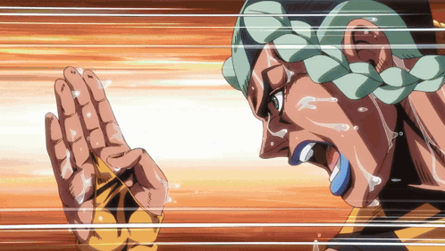

### Hi, I'm Kaziks this must be the work of an enemy Stand!

- 📝 I'm a student currently learning and looking for things to create.
- 💻 Programming as a hobby
- 👩‍🍳 A wanna be chef someday
- 🎮 Noob
- 🤓 Otaku
- ⌨️ Prefers tabs over spaces
- ⭐ Tiling managers are awesome
- 💖 Opensource

<!---->

	

<i>"Efficiency through avoidance."</i>

